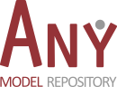

# AnyBody Managed Model Repository 
> An open library of musculoskeletal models

Official releases of the model repository is distributed with the AnyBody Modeling System, or can be downloaded from Zenodo: 

Contribute to Model Development
-------------------------------

The development of the Model Repository is a collaboration between AnyBody Technology
and many academic institutions and research projects. Development takes place in a private repository to protect academic contributors who often need to publish their models before they are publicly available.

However, access to the repository is given on request, if you want to contribute new models or 
just want to help improve existing models.

Please submit an issue here to request access:

1. Goto to https://github.com/AnyBody/ammr-doc/issues

2. Create an issue to request acess. 

